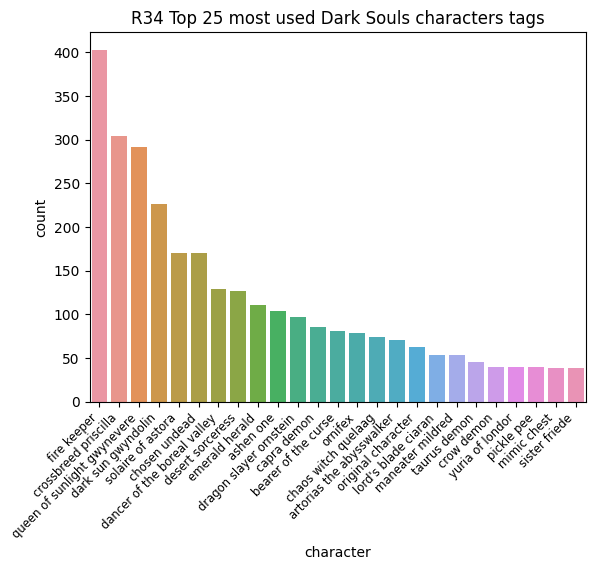

# A Wonderful Tool

This is a wonderful tool, which allows you to input any r34.xxx link to scrape the images of it and use that data further or just to download the images :D

# How to use

## Depdendencies
```
pip install scrapy numpy pandas seaborn matplotlib
```
## Actually using the thing

First, you need to run the Spider to gather the data for that change this line in re34scraper/r34scraper/spider/crawling_spider.py
```
start_urls = ["https://rule34.xxx/index.php?page=post&s=list&tags=dark_souls+"]
```
in the "" place any URL from r34.xxx after you entered a search term there, here another [example](https://rule34.xxx/index.php?page=post&s=list&tags=elden_ring+)  of a URL.

when you have done that simply run the following commandd
```
scrapy crawl r34scraper r -o output.csv 
```

## Using the data

Copy the output.csv file into the download tool and data stuff folder then you can simply run sort_data.csv, which saves the data as a new file called sorted.csv.

From there you can either just run the download or download_gui.py to download the images.

Or you can use either of the .ipynb files to generate graphs with the count of characters and their average score, but feel free to write your own thing to use the data and send a PR to the repo with it.

But for that you need to install Jupyter notebook which you can download the VS code extension for or you for whatever editor you use get the required plugin.

Here an example of a graph:


